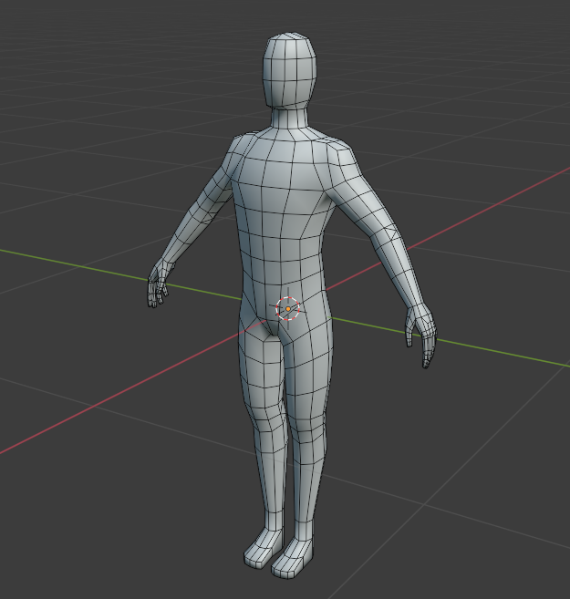

To use this 3D Male Base Mesh, you can drag .glb file into the scene,  
right-click on the male_base_mesh node and click "Make Local" 

You may then add to the scene a Camera3D node and a DirectionalLight3D.  
Then click button "Run Project" (F5) button to run the scene.  

# Godot-Male-Base-Mesh
> I'm making a game and just wanted to help other game developers so i made a  
>  male base mesh with a full rig and uv unwrapped it and put it under the CC0 license.  
>  - orange-juice-games

Submitted to [Godot Engine Asset Library](https://godotengine.org/asset-library/asset/15487)   
This is a original reupload to GitHub. 
The original author is [orange-juice-games](https://orange-juice-games.itch.io/).  

Here is a link to the original asset.  
https://orange-juice-games.itch.io/male-base-mesh

A fully rigged and UV-unwrapped male base mesh, provided under the CC0 license.   
Designed to assist game developers, this model serves as a versatile foundation for character creation.

[Male Base Mesh](https://github.com/BoQsc/Godot-Male-Base-Mesh) by [orange-juice-games](https://orange-juice-games.itch.io/) is marked with [CC0 1.0 Universal](https://creativecommons.org/publicdomain/zero/1.0/?ref=chooser-v1)  

By marking the work with a CC0 public domain dedication, the creator is giving up their copyright and allowing reusers to distribute, remix, adapt, and build upon the material in any medium or format, even for commercial purposes.

CC0: This work has been marked as dedicated to the public domain.

---- 
A 3d rigged and male base mesh, provided under the CC0 license.  
Primarily released by orange-juice-games.itch.io under CC0 license.

Remember to adjust import setting for this .glb by double clicking 3d Male Base Mesh .glb and then once it opens up for the root "Scene" toggle in the Nodes section: "Import as Skeleton".

2025-02-11 Fixed origin geometry - Tested on Godot 4.3

If you can improve it, please create an issue with details on GitHub Repository. https://github.com/BoQsc/Godot-Male-Base-Mesh/

Correct way of using with Skeleton3d node: 
1. Create a new 3d Scene
2. Drag .glb into Filesystem.
3. Drag .gllb into scene.
4. Create new Skeleton3d subnode for male_base_mesh Node.
5. Double click the male_base_mesh.glb in the Filesystem.
6. Toggle  "Import as Skeleton"
7. The bones in the Skeleton3d subnode  should now appear.

Weird bug detected in import system of Godot 4.3: 
All good for a fresh project, all bones loaded after I toggle "import as Skeleton"
It's so weird, that after I unclick "import as Skeleton" and then toggle again, the skeleton parts no longer appear ever. no matter how many times I click and unclick.

It seems like untoggling "import as Skeleton", deleting the scene, creating, creating a new scene, dragging the glb into scene then adding subnode of Skeleton3d and retoggling "import as Skeleton", the bones finally appear again.

It seems like deleting male_base_mesh from the scene, untoggling "import as Skeleton" and then dragging to create new male_base_mesh  and a new subnode Skeleton3d and then toggling "import as Skeleton"  again also helps to resolve.

Somehow now it resolves by simply removing Skeleton3d subnode , untoggling "import as Skeleton" and then creating Skeleton3d subnode  and retoggling "import as Skeleton". All bones now appear.

Alright it seems like we can ignore all the previous issues.  
I've learned enough from [Godot 4.0 Third Person Controller Tutorial ( 2023 ) by Lukky](https://youtu.be/EP5AYllgHy8?si=T9O6lg1yap_3sGD-&t=1132)

After dragging to scene you have to right click the 3d Node of "3d Male Base Mesh" and click button "Make local" this will expand to contained skeleton inside gltf file.
